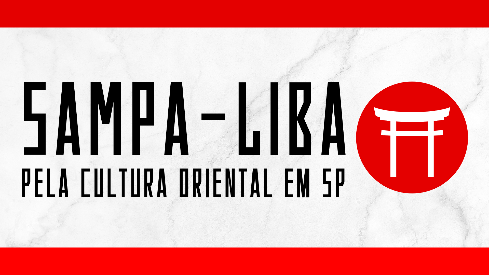

# Sampa-Liba

> ***
# Integrantes
### - Matheus Kevin dos Santos  
### - Matheus Militão da Silva

> ***
# Descrição
Aplicativo que apresenta ao público telas sobre a cultura e culinária oriental extraída da cidade "Liberdade" localizada em São Paulo, Brasil. Na tela destinada a culinária, é abordado alguns dos restaurantes mais conceituados da Liberdade, sendo escolhidos pelas suas boas avaliações e peculiaridades de cada comida preparada. Já na tela da cultura, o foco é apresentar dois dos lugares que mais concentram a cultura japonesa, escolhidos pela sua conceituação mesmo após tantos anos de fundação, e também pela sua representação condizente. Projeto iniciado no primeiro Bimestre de 2024, será realizado em Flutter e Dart pela IDE Visual Studio Code.  

> ***
# Wiki Links
### [Home](https://github.com/MKevin2/Sampa-App/wiki)
### [Desenvolvimento](https://github.com/MKevin2/Sampa-App/wiki/Desenvolvimento)
### [Telas](https://github.com/MKevin2/Sampa-App/wiki/Telas)  
### [Widgets](https://github.com/MKevin2/Sampa-App/wiki/Widgets)

> ***
